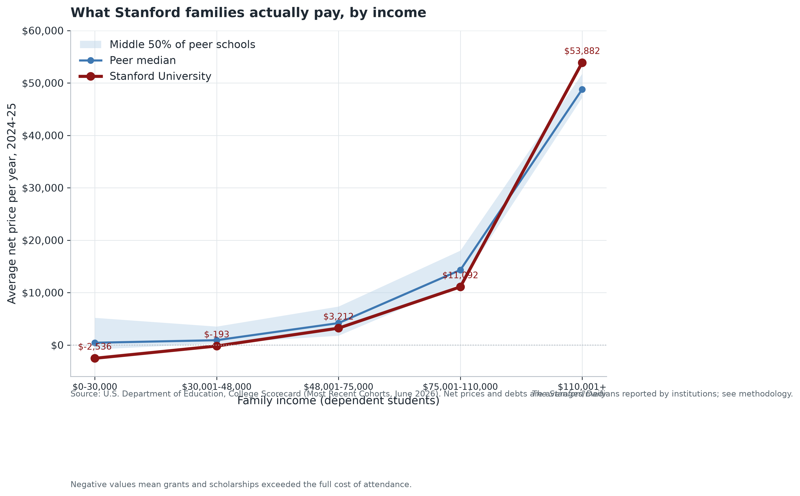

# The Price of Prestige

**What a Stanford degree is actually worth.**

A reproducible data-journalism analysis of Stanford University's price and
returns, built on the U.S. Department of Education's [College
Scorecard](https://collegescorecard.ed.gov/) and inflation-adjusted using the
BLS Consumer Price Index (FRED).



## Key findings

- **Expensive on paper, affordable in practice.** Stanford's sticker price is
  $87,833 — 2.8x the national median of $31,112. But the *average net price*
  (what students actually pay after grants) is **$13,807**, *below* the
  national median of $22,347. Families earning under $30,000 pay a **negative**
  net price: financial aid exceeds the full cost of attendance.
- **The middle class carries the cost.** Net price rises from a negative
  figure for the poorest families to **$53,882** for those earning $110,001+ —
  a roughly $56,000 swing across the income distribution.
- **The earnings premium is real and partly inherited.** Median earnings for
  Stanford graduates ten years after entry are **$124,080**, about 2.4x the
  national median. Even after controlling for net price, selectivity, Pell
  share, and the average family income of enrolled students, Stanford's
  graduates out-earn the model's prediction by roughly **47%**.
- **Graduates borrow little.** Median cumulative debt among Stanford borrowers
  is **$12,000** (low-income graduates: $6,500), versus a national median of
  $22,300.
- **Tuition has outpaced inflation, but not unusually so for its peers.**
  Published tuition rose from $24,716 in 2000-01 to $65,910 in 2024-25 (+46%
  in real terms), roughly in line with peer elite privates (+48%).

Full details are in the [feature article](article.qmd) and the
[analysis notebook](notebooks/notebook.qmd).

## Repository layout

```
article.qmd                  Feature article (Quarto)
notebooks/notebook.qmd       Reproducible analysis walkthrough (Quarto)
docs/                        Methods, design notes, glossary
scripts/                     The pipeline (download -> visualize)
  download.py                Fetch Scorecard + CPI data (idempotent)
  validate.py                Data-quality checks
  preprocess.py              Clean, merge, inflation-adjust
  analysis.py                Compute all statistics
  visualization.py           Render all figures
tests/                       Unit tests (no network access)
data/                        Raw downloads (git-ignored) + processed tables
figures/                     Generated charts (committed for the site build)
outputs/                     results.json + tables (committed)
```

## Data sources

| Source | What | Used for |
| --- | --- | --- |
| [College Scorecard](https://collegescorecard.ed.gov/) (June 2026 release) | Most-recent-cohort institution file + 1996-97..2025-26 historical archive | Cross-sectional analysis and the 30-year cost trend |
| FRED / BLS (CPIAUCSL) | Monthly CPI-U, seasonally adjusted | Expressing all dollars in 2025 dollars |

A school enters the analysis universe if it is a four-year, degree-granting
public or private non-profit institution (2,379 schools). The peer frame
compares Stanford against 16 elite private universities. The earnings/ROI
regression uses 1,079 schools with matched earnings and cost data.

## Reproduce it

Requirements: Python 3.11+ (CI runs 3.12) and [Quarto](https://quarto.org/).

```bash
# 1. Environment
python -m venv .venv
.venv\Scripts\activate            # Windows
source .venv/bin/activate         # macOS/Linux
pip install -r requirements.txt

# 2. Fetch raw data (~0.5 GB the first time) and run the whole pipeline
python -m scripts.download
python -m scripts.validate
python -m scripts.preprocess
python -m scripts.analysis
python -m scripts.visualization

# 3. Tests and lint
python -m pytest
python -m ruff check scripts tests

# 4. Render the article and notebook
quarto render article.qmd
quarto render notebooks/notebook.qmd
```

On Windows (or if `make` is available), the same steps are:

```bash
make pipeline
make tests
make lint
make render
```

## Verification

- Every statistic quoted in the article is read from
  `outputs/results.json`, regenerated by the pipeline — figures and prose
  cannot drift out of sync.
- `scripts/validate.py` runs 35+ hard checks (schema, duplicates, ranges,
  missingness, focal-school presence) before any analysis runs.
- Unit tests cover the statistics, cleaning, and validation helpers without
  touching the network.
- CI (`.github/workflows/ci.yml`) runs lint and tests on every push; the
  render workflow builds the Quarto site and deploys it to GitHub Pages.

## Notes on the data in this repo

The raw downloads (~0.5 GB) are not committed: the pipeline fetches them from
the U.S. Department of Education and FRED, and the Scorecard server blocks
GitHub's cloud IPs, so CI can't reach it either. Instead, the *derived*
artifacts (`data/processed/`, `outputs/`, `figures/`) are committed so the
site builds on Pages without network access. Refresh them with `make pipeline`
(or the Python commands above) and commit the changes.

## License

MIT — see [LICENSE](LICENSE). Data belongs to the U.S. Department of
Education and the U.S. Bureau of Labor Statistics.

*The Price of Prestige* was produced for the Stanford Daily Tech Bootcamp.
